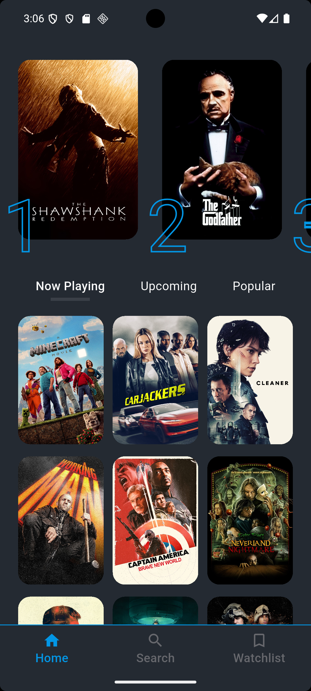
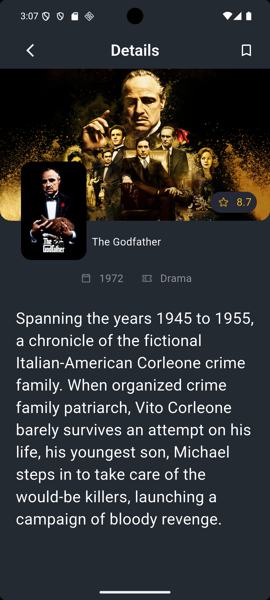

# 🎮 eyego_movies_app

A beautiful and responsive Flutter application that displays movies fetched from a public API, inspired by IMDb. This app showcases trending movies, detailed info, and more — built using clean architecture and modern Flutter development practices.

---

## 🚀 Features

- Browse trending/popular movies
- Search movies by name
- View movie details (poster, rating, overview, release date, etc.)
- Responsive UI (works on mobile and tablet)
- Smooth navigation and loading animations

---

## 🛠️ Setup Instructions

### ✅ Requirements
- Flutter SDK (latest stable version)
- Android Studio / VS Code
- Emulator or real device

### ⚙️ Getting Started

1. **Clone the repository**
   ```bash
   git clone https://github.com/ahmedyassersellow/eyego_movies_app.git
   cd eyego_movies_app
   ```

2. **Install dependencies**
   ```bash
   flutter pub get
   ```

3. **Add your API key**  
   - Get an API key from [The Movie DB (TMDb)](https://www.themoviedb.org/)
   - Create a `env.dart` file (or update the config file)
   - Example:
     ```dart
     const String apiKey = 'YOUR_API_KEY';
     ```

4. **Run the app**
   ```bash
   flutter run
   ```

---

## 🧠 Implementation Approach

### 🛆 Architecture

The app follows a **clean architecture** pattern with clear separation of concerns, following a modular feature-based structure:

- `lib/`
  - `core/`: Shared resources used across the app
    - `errors/`: Error handling utilities
    - `helper/`: Helper functions and classes
    - `services/`: Core services (e.g., API handling)
    - `utils/`: Utility classes/constants
    - `widgets/`: Shared/reusable widgets
  - `features/`: Feature-specific modules
    - `auth/`: Authentication-related screens and logic
    - `home/`: Home screen UI and logic
    - `movie_details/`: UI layer for movie detail screens
    - `search/`: Search functionality
    - `splash/`: Splash screen logic
    - `watchlist/`: Watchlist feature for saving favorite movies


### 🌐 API Integration

- Data is fetched from [TMDb API](https://developers.themoviedb.org/3)
- `Dio` is used for network calls
- Asynchronous loading handled with `BloC` (based on your approach)

### 🎨 UI & UX

- Built with Flutter widgets and Material Design
- Uses `ListView.builder`, `PageView`, and custom cards
- Loading states and error handling with graceful fallbacks

---

## 📸 Screenshots

| Home Screen | Movie Details |
|-------------|----------------|
|  |  |

---

## 🎥 Demo

Check out the app in action:

<video src="demo/demo.mp4" controls width="100%"></video>

> If the video doesn’t autoplay, download and open it manually from [`demo/demo.mp4`](demo/demo.mp4)

---

## 💡 Future Improvements

- Integrate social login (Google, Facebook) for quicker authentication.
- Add user reviews and ratings to engage users and show community feedback.
- Introduce pagination or infinite scroll for large movie lists.
- Add animations and transitions for smoother navigation and polished UI.

---

## 🤝 Contributing

Pull requests are welcome! For major changes, open an issue first to discuss what you would like to change.

---

## 🔗 Links

- [Flutter](https://flutter.dev/)
- [TMDb API](https://www.themoviedb.org/)
